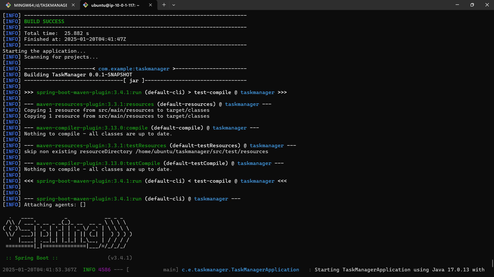

# TaskManager Application

## Overview
TaskManager is a comprehensive web application designed for efficient task management. It was developed using modern front-end technologies, containerized for portability, and deployed using Kubernetes for scalability and reliability.

## Technologies Used

### Frontend:
- **HTML**, **CSS**, **JavaScript**: Core building blocks of the application’s interface.
- **Tailwind CSS**: For styling and ensuring a responsive design.

### Backend:
- **Java with Spring Boot**: For building the back-end API and business logic.
- **Maven**: Used for managing dependencies and building the project.

### DevOps and Orchestration:
- **Docker**: For containerizing the application.
- **Docker Hub**: For storing and sharing the Docker image.
- **Kubernetes**: For orchestrating the containerized app.

## Features
- User-friendly task management interface.
- Responsive design with Tailwind CSS.
- Containerized application for portability.
- Scalable and highly available deployment using Kubernetes.

## Setup Guide

### Prerequisites
- **Docker Desktop** (with Kubernetes enabled).
- **kubectl** CLI tool.
- **Java 17+** and **Maven** installed for building the application.

### Step-by-Step Instructions

#### 1. Building the Application
1. Clone the repository:
   ```bash
   git clone https://github.com/sohelmohammed0/TASKMANAGER.git
   cd TASKMANAGER
   ```
2. Build the application using Maven:
   ```bash
   mvn clean package
   ```
3. The generated JAR file can be found in the `target` directory:
   ```plaintext
   target/taskmanager-0.0.1-SNAPSHOT.jar
   ```
4. Build Success:
   

#### 2. Containerizing the Application
1. Create a `Dockerfile` in the root directory with the following content:
   ```dockerfile
   FROM openjdk:17-jdk-alpine
   COPY target/taskmanager-0.0.1-SNAPSHOT.jar app.jar
   ENTRYPOINT ["java", "-jar", "/app.jar"]
   ```
2. Build the Docker image:
   ```bash
   docker build -t taskmanager:latest .
   ```
3. Docker Image Build:
   
4. Tag and push the Docker image to Docker Hub:
   ```bash
   docker tag taskmanager:latest your-dockerhub-username/taskmanager:latest
   docker push your-dockerhub-username/taskmanager:latest
   ```
5. Run the container locally:
   ```bash
   docker run -p 8080:8080 taskmanager:latest
   ```
6. Access the application locally:
   ```
   http://localhost:8080
   ```

#### 3. Deploying to Kubernetes

##### Creating Kubernetes Resources
1. Create a deployment YAML file (`taskmanager-deployment.yaml`):
   ```yaml
   apiVersion: apps/v1
   kind: Deployment
   metadata:
     name: taskmanager
   spec:
     replicas: 2
     selector:
       matchLabels:
         app: taskmanager
     template:
       metadata:
         labels:
           app: taskmanager
       spec:
         containers:
         - name: taskmanager
           image: your-dockerhub-username/taskmanager:latest
           ports:
           - containerPort: 8080
   ```
2. Create a service YAML file (`taskmanager-service.yaml`):
   ```yaml
   apiVersion: v1
   kind: Service
   metadata:
     name: taskmanager-service
   spec:
     type: LoadBalancer
     selector:
       app: taskmanager
     ports:
     - protocol: TCP
       port: 80
       targetPort: 8080
   ```

##### Applying Resources to the Cluster
1. Apply the deployment and service configurations:
   ```bash
   kubectl apply -f taskmanager-deployment.yaml
   kubectl apply -f taskmanager-service.yaml
   ```
2. Kubernetes Apply Commands:
   
3. Verify the resources:
   ```bash
   kubectl get all
   ```

#### 4. Accessing the Application
- If using `LoadBalancer`:
  - Check the external IP:
    ```bash
    kubectl get service taskmanager-service
    ```
  - Access the application using the external IP.
- If using port forwarding:
  ```bash
  kubectl port-forward service/taskmanager-service 8080:80
  ```
  Access the application at:
  ```
  http://localhost:8080
  ```

#### 5. Application Interface
- TaskManager Interface:
  

## Usage
1. Launch the application in your browser.
2. Use the task management interface to add, update, and delete tasks.
3. Monitor logs and performance metrics using Kubernetes tools or integrated monitoring solutions.

## Best Practices Followed
- Used containerization for consistent deployment across environments.
- Implemented orchestration with Kubernetes for scalability.
- Applied a responsive design framework for better user experience.
- Pushed the Docker image to Docker Hub for easier distribution.
- Ensured the application is modular and follows clean coding principles.

---

For questions or support, please reach out to the repository owner!

